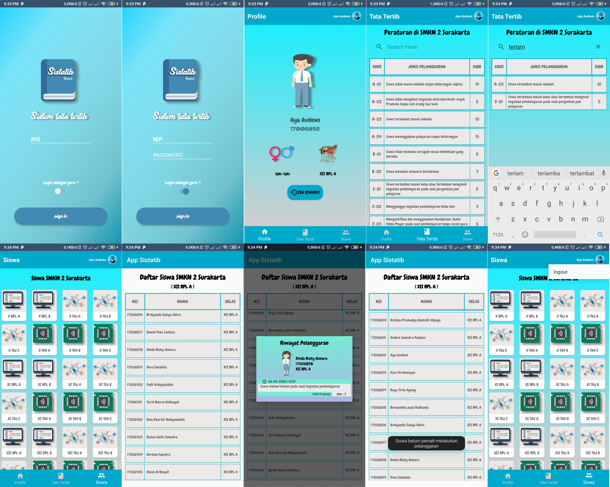
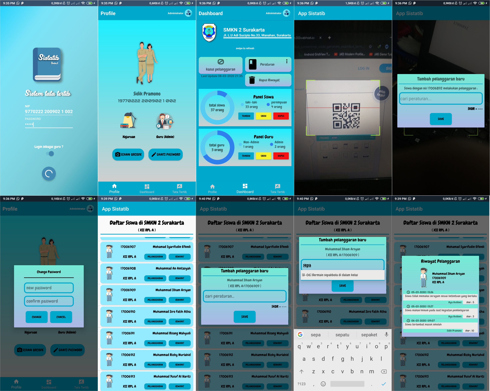
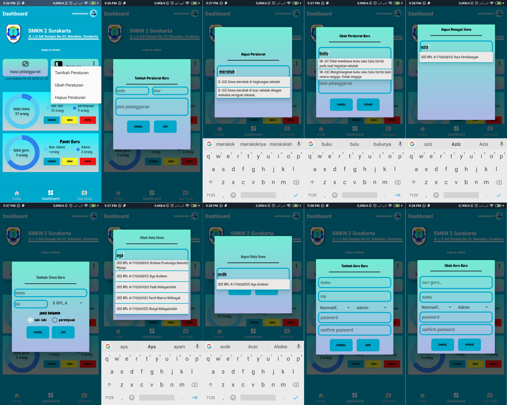

# AppSistatib
App Sistem Tata Tertib SMKN 2 Surakarta (Guru &amp; Siswa)

Aplikasi sistatib (sistem tata tertib) siswa SMKN 2 Surakarta.

aplikasi tugas akhir di SMK, yang ditujukan sebagai pengganti buku tata tertib konvensional.

Aplikasi ini menggunakan :
- CodeIgniter rest api
- loopJ

Aplikasi ini dibagi menjadi 3 user/hak akses yaitu :
- Siswa
  - profil siswa.
  - melihat peraturan (jenis pelanggaran&skor)
  - melihat daftar siswa dan riwayat pelanggaran siswa lain.
  
- Guru
  - profil guru.
  - change password.
  - scann NIS siswa dalam bentuk QRCode.
  - memberi/menambahkan pelanggaran pada riwayat siswa.
  
- Admin
  - sama seperti guru, tetapi ada beberapa tambahan hak akses :
    - menambah, mengubah, dan menghapus data & riwayat pelanggaran siswa.
    - menambah, mengubah, dan menghapus data guru.
    - menambah, mengubahm dan menghapus data peraturan/tata tertib
    

Kekurangan :
 - untuk menggunakan aplikasi harus terhubung ke internet.
 - belum dapat simpan data secara offline.
 - belum dapat menyimpan data(cookie/cache) login.
 - masih menggunakan web hosting gratisan untuk API-nya, sehingga terkadang aplikasi tidak
   bisa digunakan karena server down.

